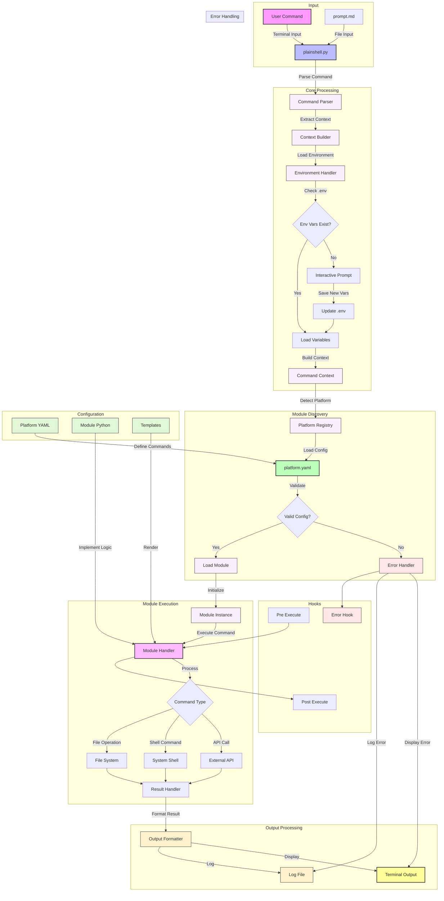

Stworzę diagram workflow dla PlainShell przedstawiający całościowy przepływ wykonania.



Example:

1. **Input**:
   ```bash
   # Terminal input
   plainshell "deploy app myapp to kubernetes"
   
   # Or from file
   plainshell prompt.md
   ```

2. **Environment Handling**:
   ```env
   # .env check/creation
   KUBERNETES_CONFIG=/path/to/kubeconfig
   DOCKER_REGISTRY=registry.example.com
   ```

3. **Platform Detection**:
   ```yaml
   # kubernetes.yaml
   name: kubernetes
   commands:
     deploy:
       description: Deploy application
       example: |
         deploy app {{ APP_NAME }} to kubernetes
   ```

4. **Module Execution**:
   ```python
   # kubernetes_module.py
   class KubernetesModule:
       async def execute(self, command: str, context: Dict[str, Any]) -> str:
           # Deploy logic
           return "Deployed successfully"
   ```

5. **Output**:
   ```bash
   # Terminal output
   ✓ Application myapp deployed to kubernetes
   
   # Logs
   [2024-01-15 10:30:45] Deployed application myapp...
   ```

Dodatkowe elementy:

1. **Hooks System**:
```python
# Pre-execute hook
@registry.hook('pre_execute')
async def validate_resources(context: CommandContext):
    # Validate available resources
    pass

# Post-execute hook
@registry.hook('post_execute')
async def notify_slack(result: str):
    # Send notification
    pass
```

2. **Templates**:
```yaml
# deployment.yml.j2
apiVersion: apps/v1
kind: Deployment
metadata:
  name: {{ APP_NAME }}
spec:
  replicas: {{ REPLICAS }}
```

3. **Error Handling**:
```python
try:
    result = await module.execute(command)
except ModuleError as e:
    logger.error(f"Module execution failed: {e}")
    await error_hooks.execute(e)
```

Główne zalety tej architektury:

1. **Modułowość**:
   - Łatwe dodawanie nowych platform
   - Wymienne komponenty
   - Izolacja kodu

2. **Elastyczność**:
   - Wsparcie dla różnych typów wejścia
   - Różne formaty wyjścia
   - Konfigurowalne zachowanie

3. **Rozszerzalność**:
   - System hooków
   - Szablony
   - Własne moduły

4. **Bezpieczeństwo**:
   - Walidacja komend
   - Zarządzanie sekretami
   - Logowanie operacji

5. **Użyteczność**:
   - Interaktywne uzupełnianie
   - Dokumentacja w kodzie
   - Przykłady użycia


# [python.plainshell.com](http://python.plainshell.com)

+ plainedit.com pozwala na wykonywanie takich plików i konwersję
+ plainshell.com pozwala nie tylko wyknywanie pliku markdown jako pliku skryptowego zawierającego dane dot. różnych jezyków programownaia w formie shell
  + wzbogacony jest o API do np. chatgpt poprzez API
  + pliku projektów są przechowywane lokalnie
  + wyszukiwanie danych wczesniej wygenerowanych, łączenie projektów w kolejny
  + synchronizacja danych z repozytorium git 


---
+ [edit](https://github.com/plainshell/python/edit/main/README.md)
